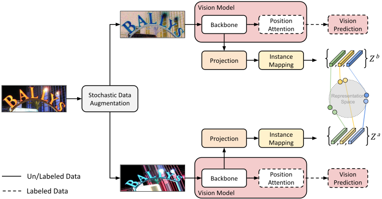
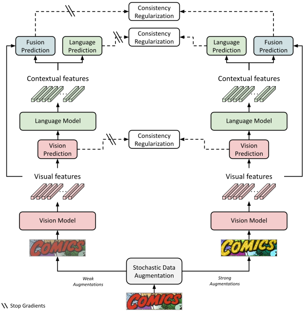
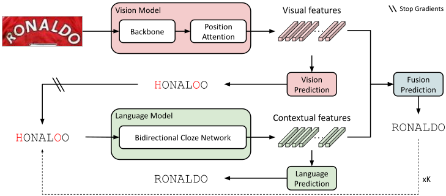

# Multimodal Semi-Supervised Learning for Text Recognition

The official code implementation of SemiMTR [Paper](https://arxiv.org/pdf/2205.03873) 
| [Pretrained Models](#Pretrained-Models) | [SeqCLR Paper](https://arxiv.org/pdf/2012.10873)
|  [Citation](#citation) | [Demo](#demo).

**[Aviad Aberdam](https://sites.google.com/view/aviad-aberdam/home),
[Roy Ganz](https://il.linkedin.com/in/roy-ganz-270592),
[Shai Mazor](https://il.linkedin.com/in/shai-mazor-529771b),
[Ron Litman](https://scholar.google.com/citations?hl=iw&user=69GY5dEAAAAJ)**

We introduce a multimodal semi-supervised learning algorithm for text recognition, which is customized for modern
vision-language multimodal architectures. To this end, we present a unified one-stage pretraining method for the vision
model, which suits scene text recognition. In addition, we offer a sequential, character-level, consistency
regularization in which each modality teaches itself. Extensive experiments demonstrate state-of-the-art performance on
multiple scene text recognition benchmarks.

### Figures

<figure>
  <p align="center"></p>
  <figcaption><p align="center"><b>Figure 1:</b> SemiMTR vision model pretraining: Contrastive learning </p></figcaption>
</figure>
<br/><br/>

<figure>
  <p align="center"></p>
  <figcaption><p align="center"><b>Figure 2:</b> SemiMTR model fine-tuning: Consistency regularization </p></figcaption>
</figure>

<!-- <br/><br/>
<figure>
  <p align="center"></p>
  <figcaption><p align="center"><b> SemiMTR model architecture: ABINet Model </b></p></figcaption>
</figure> -->
  

# Getting Started

<h3 id="demo"> 
    Run Demo with Pretrained Model 
    <a 
    href="https://colab.research.google.com/github/amazon-research/semimtr-text-recognition/blob/master/notebook_demo.ipynb" target="_parent">
    
    </a> 
</h3>

## Dependencies

- Inference and demo requires PyTorch >= 1.7.1
- For training and evaluation, install the dependencies

```
pip install -r requirements.txt
```

## Pretrained Models

Download pretrained models:

- [SemiMTR Real-L + Real-U](https://awscv-public-data.s3.us-west-2.amazonaws.com/semimtr/semimtr_real_l_and_u.pth)
- [SemiMTR Real-L + Real-U + Synth](https://awscv-public-data.s3.us-west-2.amazonaws.com/semimtr/semimtr_real_l_and_u_and_synth.pth)
- [SemiMTR Real-L + Real-U + TextOCR](https://awscv-public-data.s3.us-west-2.amazonaws.com/semimtr/semimtr_real_l_and_u_and_textocr.pth)

Pretrained vision models:

- [SemiMTR Vision Model Real-L + Real-U](https://awscv-public-data.s3.us-west-2.amazonaws.com/semimtr/semimtr_vision_model_real_l_and_u.pth)

Pretrained language model:

- [ABINet Language Model](https://awscv-public-data.s3.us-west-2.amazonaws.com/semimtr/abinet_language_model.pth)


For fine-tuning SemiMTR without vision and language pretraining, locate the above models in a `workdir` directory, as follows:

    workdir
    ├── semimtr_vision_model_real_l_and_u.pth
    ├── abinet_language_model.pth
    └── semimtr_real_l_and_u.pth

### SemiMTR Models Accuracy

|Training Data|IIIT|SVT|IC13|IC15|SVTP|CUTE|Avg.|COCO|RCTW|Uber|ArT|LSVT|MLT19|ReCTS|Avg.|
|-|-|-|-|-|-|-|-|-|-|-|-|-|-|-|-|
|Synth (ABINet)|96.4|93.2|95.1|82.1|89.0|89.2|91.2|63.1|59.7|39.6|68.3|59.5|85.0|86.7|52.0|
|Real-L+U|97.0|95.8|96.1|84.7|90.7|94.1|92.8|72.2|76.1|58.5|71.6|77.1|90.4|92.4|65.4|
|Real-L+U+Synth|97.4|96.8|96.5|84.7|92.9|95.1|93.3|73.0|75.7|58.6|72.4|77.5|90.4|93.1|65.8|
|Real-L+U+TextOCR|97.3|97.7|96.9|86.0|92.2|94.4|93.7|73.8|77.7|58.6|73.5|78.3|91.3|93.3|66.1|


## Datasets

- Download preprocessed lmdb dataset for training and
  evaluation.  [Link](https://github.com/ku21fan/STR-Fewer-Labels/blob/main/data.md#download-preprocessed-lmdb-dataset-for-traininig-and-evaluation)
- For training the language model, download WikiText103. [Link](https://github.com/FangShancheng/ABINet#datasets)
- The final structure of `data` directory can be found in [`DATA.md`](data/DATA.md).

## Training

1. Pretrain vision model
    ```
    CUDA_VISIBLE_DEVICES=0,1,2,3 python main.py --config configs/semimtr_pretrain_vision_model.yaml
    ```
2. Pretrain language model
    ```
    CUDA_VISIBLE_DEVICES=0,1,2,3 python main.py --config configs/pretrain_language_model.yaml
    ```
3. Train SemiMTR
    ```
    CUDA_VISIBLE_DEVICES=0,1,2,3 python main.py --config configs/semimtr_finetune.yaml
    ```

Note:

- You can set the `checkpoint` path for vision and language models separately for specific pretrained model, or set
  to `None` to train from scratch

### Training ABINet

1. Pre-train vision model
    ```
    CUDA_VISIBLE_DEVICES=0,1,2,3 python main.py --config configs/abinet_pretrain_vision_model.yaml
    ```
2. Pre-train language model
    ```
    CUDA_VISIBLE_DEVICES=0,1,2,3 python main.py --config configs/pretrain_language_model.yaml
    ```
3. Train ABINet
    ```
    CUDA_VISIBLE_DEVICES=0,1,2,3 python main.py --config configs/abinet_finetune.yaml
    ```

## Evaluation

```
CUDA_VISIBLE_DEVICES=0 python main.py --config configs/semimtr_finetune.yaml --run_only_test
```

## Arguments:

- `--checkpoint /path/to/checkpoint` set the path of evaluation model
- `--test_root /path/to/dataset` set the path of evaluation dataset
- `--model_eval [alignment|vision]` which sub-model to evaluate

## Citation

If you find our method useful for your research, please cite

```
@article{aberdam2022multimodal,
  title={Multimodal Semi-Supervised Learning for Text Recognition},
  author={Aberdam, Aviad and Ganz, Roy and Mazor, Shai and Litman, Ron},
  journal={arXiv preprint arXiv:2205.03873},
  year={2022}
}

@inproceedings{aberdam2021sequence,
  title={Sequence-to-sequence contrastive learning for text recognition},
  author={Aberdam, Aviad and Litman, Ron and Tsiper, Shahar and Anschel, Oron and Slossberg, Ron and Mazor, Shai and Manmatha, R and Perona, Pietro},
  booktitle={Proceedings of the IEEE/CVF Conference on Computer Vision and Pattern Recognition},
  pages={15302--15312},
  year={2021}
}
 ```

## Acknowledgements

This implementation is based on the repository [ABINet](https://github.com/FangShancheng/ABINet).

## Security

See [CONTRIBUTING](CONTRIBUTING.md#security-issue-notifications) for more information.

## License

This project is licensed under the Apache-2.0 License.

## Contact

Feel free to contact us if there is any question: [Aviad Aberdam](mailto:aaberdam@amazon.com?subject=[GitHub-SemiMTR])
